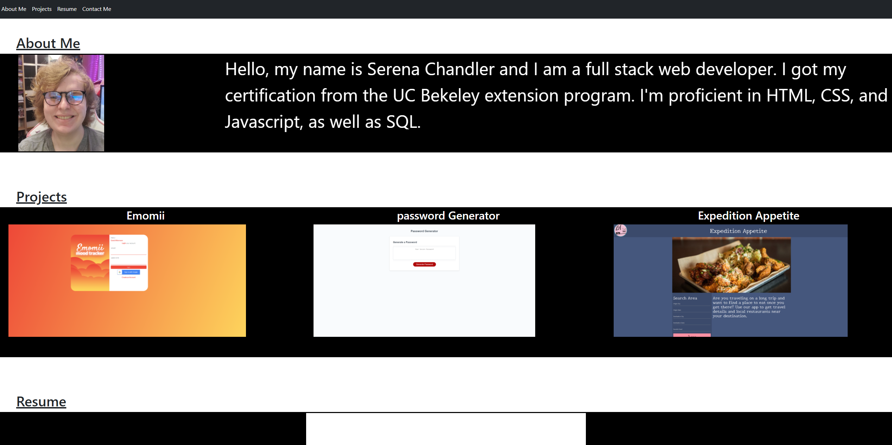

# Portfolio-revision-3

## Summary

A third revision of my portfolio

## Languages Used
-HTML was used for the basic Structure

-BootStrap was used as a template to help style the page

-CSS was used for additional styling

## Preview



## Code Snippets

Creating contact links
```
   <h2>
        <a href="https://github.com/SerenaChandler" target="_blank">GitHub</a>
    </h2>

    <h2>
        <a href="https://www.linkedin.com/in/serena-chandler-b62a39204/" target="_blank">Linkedin</a>
    </h2>

    <h2>
        <a href="mailto:serenachandler2019@gmail.com">Email</a>
    </h2>
```

Creating a clickable button to download my resume
```
<h2>
    <a href="https://github.com/SerenaChandler" target="_blank">GitHub</a>
</h2>
<h2>
    <a href="https://www.linkedin.com/in/serena-chandler-b62a39204/" target="_blank">Linkedin</a>
</h2>

<h2>
    <a href="mailto:serenachandler2019@gmail.com">Email</a>
</h2>
```

Implementing Bootstrap to format site into columns
```
    <div id="aboutMe">
      <h1 class="section">About Me</h1>
      <div id="aboutMeBox" class="row">
        <div class="col-xl-3">
          
        </div>
        <div class="col-xl-9 aboutMeText">
          Hello, my name is Serena Chandler and I am a full stack web developer.
          I got my certification from the UC Bekeley extension program. I'm
          proficient in HTML, CSS, and Javascript, as well as SQL.
        </div>
      </div>
    </div>
```

## my links
[Github](https://github.com/SerenaChandler),    
[Linkedin](https://www.linkedin.com/in/serena-chandler-b62a39204/),     
[updated portfolio](https://github.com/SerenaChandler/Portfolio-revision-3)
      